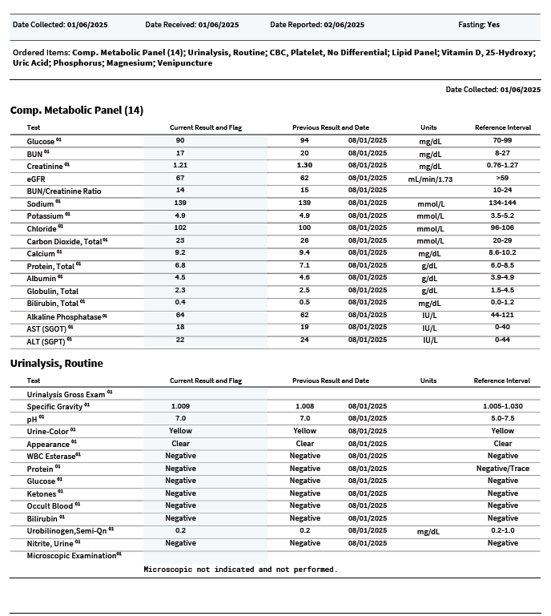
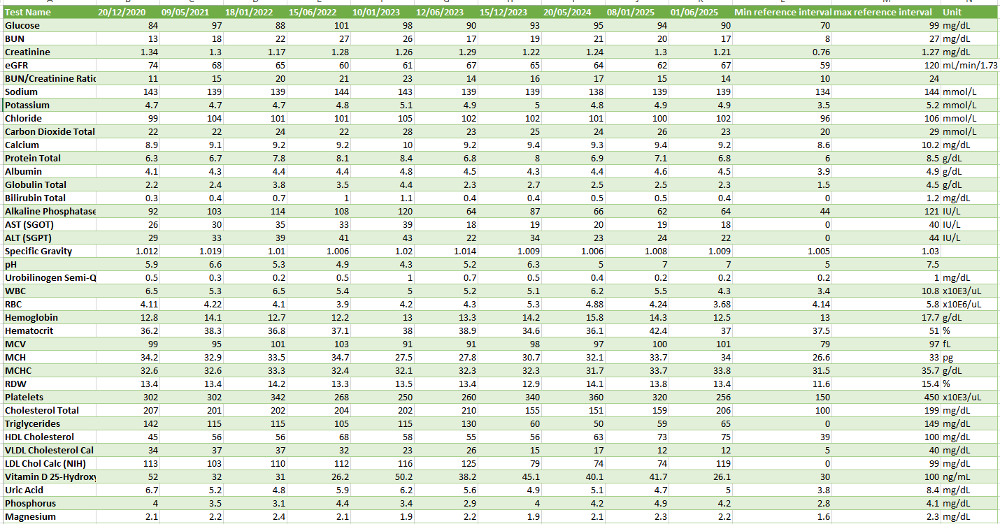
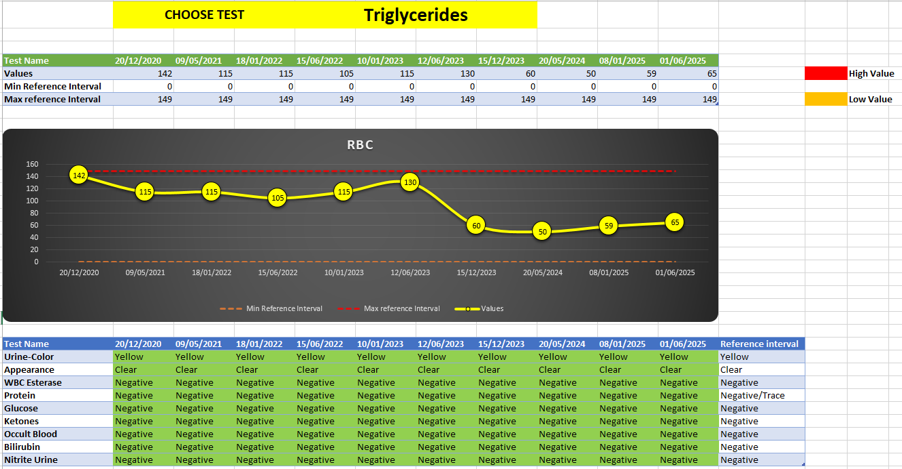

# pdftoexcel-powerquery-dashboard
Convert raw PDF reports into structured Excel dashboards | Power Query | Data Cleaning | Excel Automation  

# 📊 PDF to Excel PowerQuery Dashboard  

This project demonstrates how I convert **raw or unstructured PDF data** into a clean, structured Excel dashboard using **Power Query** and advanced Excel techniques.  

---

## 📝 Problem  
Clients often share reports in PDF format which are messy and unstructured.  
Such files are difficult to analyze, filter, or create meaningful dashboards from.  

---

## ✅ Solution  
- Converted PDF reports into **structured Excel tables**  
- Cleaned & formatted data using **Power Query**  
- Applied **data validation and conditional formatting**  
- Built a **trend report dashboard** with dynamic charts and insights  

---

## 📂 Project Files  
- 📄 [Sample Input PDF](Sample input.pdf)  
- 📊 [Final Excel Dashboard](‎Health_data_sample_output_file.xlsx)  

---

## 📸 Before & After  

**Raw PDF Input:**  
  

**Clean Excel Output:**  
  
 

---

## ⚙️ Tools Used  
- Microsoft Excel  
- Power Query  
- Excel Functions (INDEX, MATCH, SEARCH, etc.)  

---

## 💼 Services I Offer  
- PDF → Excel Conversion  
- Data Cleaning & Transformation  
- Excel Dashboards & Reports  
- Automation with Excel & Power Query  

---

## 📩 Contact  
📧 Email: pushpalkawara101@gmail.com  
